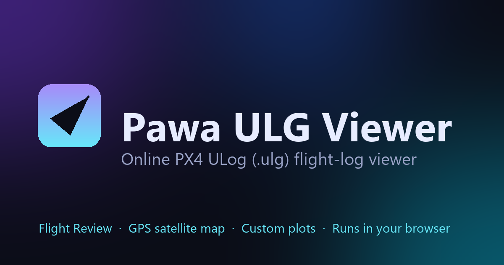

# Pawa ULG Viewer

**A free, online PX4 ULog (`.ulg`) flight-log viewer that runs entirely in your browser.**

Drag in a PX4 `.ulg` log and instantly get a full **Flight Review** — altitude,
attitude, GPS track on a satellite map, velocity, battery, and raw sensor plots —
plus a **custom inspector** to plot any signal from any topic. No upload, no
account, nothing installed. Your log never leaves your computer.

### ▶ Live demo: **https://muhammadtalhapawa.github.io/Pawa-ULG-Viewer/**



---

## Table of contents

- [Features](#features)
- [How it works](#how-it-works)
- [Privacy](#privacy)
- [The three pages](#the-three-pages)
- [Run it locally](#run-it-locally)
- [Optional: the Flask server build](#optional-the-flask-server-build)
- [Deploy to GitHub Pages](#deploy-to-github-pages)
- [Project structure](#project-structure)
- [Tech stack](#tech-stack)
- [Limitations](#limitations)
- [Credits](#credits)

---

## Features

- **In-browser ULog parsing** — a from-scratch JavaScript parser reads the binary
  PX4 ULog format. No Python and no server needed; verified field-for-field
  against [`pyulog`](https://github.com/PX4/pyulog).
- **PX4 Flight Review** — the standard plot set in one scrollable page:
  - Altitude estimate, roll/pitch/yaw **angles and rates**
  - Local position X/Y/Z, velocity, manual control, actuator & motor outputs
  - Raw accelerometer / gyroscope / magnetometer
  - GPS uncertainty, noise & jamming, power/battery, temperature, failsafe, CPU & RAM
- **GPS trajectory on a satellite map** (Leaflet + Esri World Imagery), with start/end
  markers and a "center on flight data" button.
- **Position (X/Y) plot** overlaying estimated, setpoint, groundtruth, GPS-projected,
  and position-setpoint waypoints.
- **Flight summary card** — duration, distance, max speeds, max tilt, lifetime flight
  time, airframe and firmware info.
- **Custom inspector** — searchable tree of every topic and field; plot selected
  signals, plot all, or double-click to plot.
- **Favorites** — star any field; saved per-user in your browser.
- **Day / night theme** — toggled live, remembered per-user.
- **Drag & drop** a `.ulg` anywhere, or browse from your PC.

## How it works

There is **no backend**. Everything happens client-side:

1. You pick or drop a `.ulg` file. The browser reads its bytes with
   `File.arrayBuffer()`.
2. [`ulog-parser.js`](ulog-parser.js) decodes the binary ULog format into topics
   and fields in memory.
3. The raw bytes are cached in **IndexedDB** so the file survives navigation between
   the pages (it is never sent over the network).
4. [`analysis.js`](analysis.js) builds the Flight Review panels, the map data, and
   the flight-summary statistics; [Plotly](https://plotly.com/javascript/) and
   [Leaflet](https://leafletjs.com/) render them.

Because it's all static files, it's hosted for free on GitHub Pages.

## Privacy

**Your flight log never leaves your machine.** It is parsed locally and held only
in your browser's memory / IndexedDB. There is no upload endpoint and no analytics
on the file contents. Clearing your browser data removes it.

## The three pages

| Page | File | What it does |
|------|------|--------------|
| Landing | [`index.html`](index.html) | Minimal drag-and-drop / browse entry point |
| Flight Review | [`review.html`](review.html) | The full PX4 standard plot set + map + summary |
| Custom View | [`inspector.html`](inspector.html) | Topic/field tree, search, plot any signal, favorites |

## Run it locally

Browsers block IndexedDB on `file://`, so serve the folder over HTTP:

```bash
# from the repo root
python -m http.server 8080
# then open http://localhost:8080/
```

Any static file server works (e.g. `npx serve`, VS Code Live Server).

## Optional: the Flask server build

The repo also ships the original **server-side** version (parses with Python
`pyulog` instead of the in-browser parser). It's handy for very large logs where
you'd rather use a machine's CPU/RAM than the browser's.

```bash
pip install -r requirements.txt
python main.py
# opens http://127.0.0.1:8000/
```

The Flask app serves the `web/` frontend and parses uploads server-side, deleting
the temp file immediately after parsing (data is held in RAM per session). The
static build in the repo root is independent of this and needs no Python.

## Deploy to GitHub Pages

1. Commit the static files at the repo root (`index.html`, `review.html`,
   `inspector.html`, the `.js`/`.css` files, `og-image.png`, `sitemap.xml`,
   `robots.txt`).
2. **Settings → Pages → Build and deployment**: Source = *Deploy from a branch*,
   Branch = `main`, Folder = **`/ (root)`**, then **Save**.
3. GitHub serves `index.html` as the entry page. Live in a minute or two.

> GitHub Pages "Deploy from a branch" only allows the repo **root** or **`/docs`**,
> so the site files live at the root here.

## Project structure

```
Pawa-ULG-Viewer/
├── index.html          # Landing page (entry)
├── review.html         # Flight Review
├── inspector.html      # Custom inspector
├── ulog-parser.js      # Pure-JS binary ULog parser (replaces pyulog)
├── analysis.js         # Flight-review panels, map, stats (ported from main.py)
├── store.js            # IndexedDB persistence + shared UI helpers
├── landing.js          # Landing controller
├── review.js           # Flight Review controller
├── inspector.js        # Inspector controller
├── style.css           # Core styling + theme tokens
├── review.css          # Flight Review styling
├── og-image.png        # Social share / preview card
├── sitemap.xml         # SEO sitemap
├── robots.txt          # SEO robots
│
├── main.py             # Optional Flask server build
├── requirements.txt    # Python deps for the Flask build
├── web/                # Frontend used by the Flask build
└── data/               # Sample PX4 .ulg logs
```

## Tech stack

- **Vanilla JavaScript** (no framework, no build step)
- **[Plotly.js](https://plotly.com/javascript/)** — interactive charts
- **[Leaflet](https://leafletjs.com/) + [Esri World Imagery](https://www.esri.com/)** — satellite map
- **IndexedDB** — client-side file persistence
- **Python + [Flask](https://flask.palletsprojects.com/) + [pyulog](https://github.com/PX4/pyulog) + NumPy** — optional server build

## Limitations

- Large logs are parsed using your device's RAM/CPU (a few-MB log is sub-second;
  hundreds of MB will be slower). For very large logs, prefer the Flask build.
- The chart library and map tiles load from public CDNs, so plots and the map need
  an internet connection (the parser itself works offline).

## Credits

- Built around the **[PX4 ULog file format](https://docs.px4.io/main/en/dev_log/ulog_file_format.html)**.
- Plot set inspired by **[PX4 Flight Review](https://logs.px4.io/)**.
- Parser validated against **[pyulog](https://github.com/PX4/pyulog)**.
- Map tiles © Esri — Source: Esri, Maxar, Earthstar Geographics, and the GIS user community.

---

Made by **[Muhammad Talha](https://github.com/MuhammadTalhaPawa)** ·
Try it live → **https://muhammadtalhapawa.github.io/Pawa-ULG-Viewer/**
